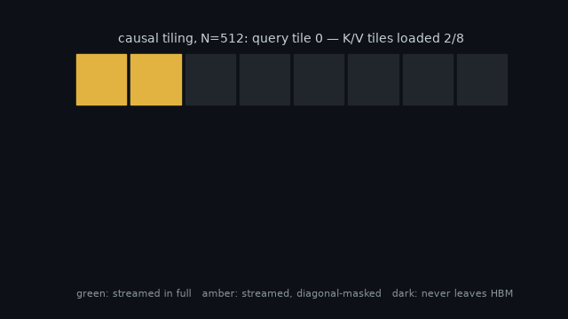
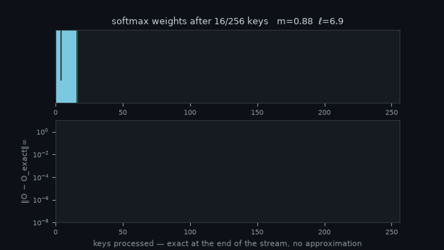

# flash-attention-cuda

> [FlashAttention](https://arxiv.org/abs/2205.14135) (Dao et al., 2022) implemented from scratch in CUDA — exact attention computed tile-by-tile in on-chip SRAM, so the N×N score matrix **never exists in HBM**.


[](https://colab.research.google.com/github/agupt0318/flash-attention-cuda/blob/main/demo/flash_attention_colab.ipynb)

<p align="center">
  
</p>

## The idea

Attention is `O = softmax(QKᵀ/√d)·V`. The standard implementation writes the N×N matrices `S` and `P` to GPU HBM and reads them back — at N=4K that's gigabytes of traffic per head-batch for intermediates nobody keeps. Most of "attention is slow" is that traffic: the operation is memory-bound, and HBM is an order of magnitude slower than on-chip SRAM.

FlashAttention restructures the computation so each K/V tile is loaded to SRAM once and fully consumed. The trick that makes tiling legal is the **online softmax**: softmax over a concatenation decomposes if you carry a running max `m` and normalizer `ℓ`,

```
m' = max(m, s)          — new score s arrives
ℓ' = ℓ·e^(m−m') + e^(s−m')
acc' = acc·e^(m−m') + e^(s−m')·v
```

so the output row is just `acc/ℓ` after the last tile — exact, not approximate, with `O(N)` extra memory instead of `O(N²)`. HBM accesses drop from `Θ(Nd + N²)` to `Θ(N²d²M⁻¹)` (Theorem 2 of the paper).

## The kernel

[src/flash_fwd.cu](src/flash_fwd.cu) — fp32 forward, head dims 32/64, optional causal mask:

- **Grid**: one CTA per (query tile, batch·head); one thread per query row. The row's `q`, running `m`/`ℓ`, and unnormalized accumulator live in **registers** for the entire pass — the only HBM writes are the final `O` row and the logsumexp.
- **K/V stream through shared memory** in 64-row tiles, loaded cooperatively by the whole CTA. Score matrix rows exist one register at a time.
- **Softmax statistics** update per-key (Algorithm 1 with `Bc=1` for the stats; the IO tiling is the paper's) — a fresh max rescales history by `e^(m−m')` before the key folds in.
- **Causal masking** costs what it saves: tiles past a CTA's last row are never loaded, and each row breaks out of the key stream at the diagonal. Watching the loads is the clearest way to see it — green tiles stream in full, amber diagonal tiles stream and get masked per-row, dark ones never leave HBM:

<p align="center">
  
</p>

- **Logsumexp per row** is written out — the statistic the backward pass recomputes `P` from, so the forward is already backward-shaped.

## Watch the recurrence work

One query row streaming through K/V tiles — the green window is the tile currently in SRAM. The weights renormalize as the running max updates, and the output snaps to **exact** (‖error‖ ≈ 1e-7) the moment the last key folds in. No approximation anywhere; the animation is generated from the same recurrence the kernel runs ([tools/make_convergence_gif.py](tools/make_convergence_gif.py), deterministic).

<p align="center">
  
</p>

## Correctness without owning a GPU

This was built on a machine with no NVIDIA hardware, so correctness is layered:

1. [src/reference.cpp](src/reference.cpp) — naive attention, double accumulation: the ground truth.
2. [src/flash_cpu.cpp](src/flash_cpu.cpp) — **the flash algorithm on the CPU**, same tiling, same float precision the kernel uses. Validated against the reference across ragged shapes (N = 33, 257, 300…), both mask modes: `make test`, errors ~1e-6.
3. [src/flash_fwd.cu](src/flash_fwd.cu) mirrors the validated recurrence; CI compiles it with nvcc on every push, and [tests/test_gpu.cu](tests/test_gpu.cu) checks it against the reference at 5e-5 on real hardware (`make test-gpu`).

The algorithm's math never had to be debugged through a device boundary — by the time CUDA entered, only CUDA could be wrong.

<p align="center">
  
</p>

## PyTorch

The kernel is a drop-in op — same layout contract as `scaled_dot_product_attention` with explicit heads:

```python
import sys; sys.path.insert(0, "pytorch")
from flash_attn import flash_attention

o = flash_attention(q, k, v, causal=True)   # [batch, heads, seq, head_dim] fp32 CUDA
```

The extension JIT-compiles on first import (needs `nvcc`, a CUDA build of torch, and `pip install ninja` — torch's extension builder requires it), launches on torch's current stream, and validates its whole contract up front. `python3 pytorch/test_parity.py` checks it against a **float64** reference with SDPA alongside as the sanity anchor; add `bench` for a timing table vs SDPA. Inference-only until the backward kernel lands.

## The paper's future work, answered: Triton

Section 5 of the paper points at its own biggest limitation — every attention variant needs a new hand-written CUDA kernel, tied to an architecture, and calls for *"writing attention algorithms in a high-level language … and compiling to IO-aware implementations in CUDA — similar to efforts such as Halide."* That compiler now exists in the ecosystem: **Triton**. [triton/flash_attn_triton.py](triton/flash_attn_triton.py) is the same forward pass through it, so this repo holds both sides of the abstraction argument:

| | [src/flash_fwd.cu](src/flash_fwd.cu) (hand CUDA) | [triton/flash_attn_triton.py](triton/flash_attn_triton.py) (compiled) |
|---|---|---|
| softmax stats | per-key, in registers | per-tile (`Algorithm 1` verbatim), `tl.dot` matmuls |
| scheduling | explicit — smem tiles, `__syncthreads`, cooperative loads | the compiler's problem |
| portability | `-arch=sm_XX` | retune two block sizes |
| lines of kernel | ~120 | ~70 |

Same contract, same float64 judge: `python3 triton/test_parity.py` checks the Triton kernel — and the CUDA one alongside, when its extension is importable — against the exact reference on the usual hostile shapes. `allow_tf32` is off so the tolerances mean something; it's the first knob to flip when chasing speed instead of digits.

The four phases of the recurrence, highlighted in both languages at once — the left pane spends its time on loads, barriers, and register loops; the right pane's equivalent is a masked `tl.load` and a `tl.dot`:

<p align="center">
  
</p>

## Try it on a free GPU

Everything in the verification story, one click: [the Colab notebook](https://colab.research.google.com/github/agupt0318/flash-attention-cuda/blob/main/demo/flash_attention_colab.ipynb) clones the repo on a free T4, runs the CPU suite, compiles and checks the CUDA kernel for whatever GPU it lands on, runs both parity suites, and ends with a CUDA-vs-Triton-vs-SDPA timing plot.

## Numbers (Colab T4, fp32 forward, B=4 H=8 d=64)

From a full notebook run — every test green, then the timing sweep:

| N | cuda (ours) | triton (ours) | torch SDPA | naive (N² in HBM) | naive peak mem |
|---|---|---|---|---|---|
| 512 | 2.115 ms | 4.406 ms | 1.610 ms | **1.121 ms** | 0.09 GiB |
| 1024 | 3.363 ms | 8.646 ms | 2.770 ms | 4.705 ms | 0.29 GiB |
| 2048 | 12.592 ms | 34.036 ms | 11.335 ms | 19.201 ms | 1.07 GiB |
| 4096 | 47.714 ms | 135.868 ms | 45.492 ms | 83.251 ms | **4.13 GiB** |

(flash-family peak mem is 0.02–0.13 GiB — the inputs and output, nothing else.)

Reading it honestly, in both directions:

- **The algorithm's claim reproduces.** Naive attention — cuBLAS matmuls plus a materialized softmax — *wins below N≈1024*: its matmuls are perfect and the score matrix still fits in cache. That crossover is in the paper. Past it, N² physics takes over: at N=4096 flash is **1.75× faster and uses 32× less memory**, and the naive curve is on its way to an OOM no tiled implementation will ever meet.
- **SDPA still beats our kernel at every length** — 1.3× at N=512, ~5% at N=4096. Context: at fp32 on a T4, SDPA dispatches to its memory-efficient backend — itself a flash-style IO-aware kernel with years of tuning — so this is a loss to a production sibling, not to the algorithm's opponent. The gap is being worked: an ILP round (independent partial sums in the dot) bought 16% at N=1024 and nothing at N=4096, which killed the latency-bound hypothesis and pointed at **shared-memory issue rate** — one 4-byte `LDS` per FMA caps the math pipes. `float4` smem reads are the current attempt. The Triton rendering trails ~3× on strict-IEEE dots; autotuning recovered ~10%.

## Build & run

```sh
make test                  # CPU: tiled algorithm vs reference (no GPU needed)
make cuda                  # compile kernels without running (what CI does)
make test-gpu ARCH=sm_80   # on a CUDA box: kernel vs reference
make bench  ARCH=sm_80     # wall time, TFLOP/s, and the N² traffic avoided
```

`ARCH` defaults to `sm_70`; set it to your GPU (`sm_80` A100, `sm_86` 3090, `sm_89` 4090). GPU numbers pending a hardware run — the bench prints ms, achieved TFLOP/s, and the HBM traffic a materialized attention matrix would have cost.

## Layout

```
src/
  attention.h     the one API both CPU implementations share
  reference.cpp   naive attention, double accumulation (ground truth)
  flash_cpu.cpp   Algorithm 1 on the CPU — validates the math locally
  flash_gpu.h     host-side contract + CUDA_CHECK
  flash_fwd.cu    the kernel + dispatch
  bench.cu        timing/TFLOPs harness
tests/
  test_cpu.cpp    tiled vs reference, shapes chosen to hurt
  test_gpu.cu     kernel vs reference, same shapes + N=1024
pytorch/
  binding.cpp     torch extension: contract checks + current-stream launch
  flash_attn.py   JIT front door — flash_attention(q, k, v, causal)
  test_parity.py  vs float64 reference, SDPA as sanity anchor (+ bench)
triton/
  flash_attn_triton.py  the same algorithm through a compiler
  test_parity.py        three implementations, one float64 judge
```

## Roadmap

- [x] Run the numbers on real hardware — Colab T4 table above, via the notebook
- [ ] Backward pass — recompute `P` from `O` + logsumexp per the paper's Appendix B, then a real autograd.Function
- [ ] Close the gap to SDPA's mem-efficient kernel: >1 query row per thread, vectorized (float4) loads, occupancy/register tuning — the N=512 1.8× is the target
- [ ] Block size tuning (CUDA and the Triton ~3× gap — config, not concept) + head dim 128
- [ ] fp16/bf16 with tensor-core matmuls on Ampere+ (the fp32 kernel is the correctness baseline; fp32 is also all a T4 can show)
- [ ] Block-sparse variant (Section 3.3)

## License

[MIT](LICENSE)
